# iApp Runner

<div align="center">


**基于裕语言 V3 语法的 跨平台解释器**

[English](#english) | 简体中文

</div>

---

## 免责声明

**本项目为非官方第三方实现**，与 iApp 官方团队无任何关联。

本项目仅用于学习交流目的，旨在让开发者能够在 PC 端运行和调试裕语言脚本。请勿用于商业用途。

---

## 特性

- 完美支持裕语言 V3 全部语法
- 跨平台运行（Windows / macOS / Linux）
- 完整的词法分析、语法分析、解释执行
- 支持自定义函数与模块化开发
- 支持 Java 互操作
- 支持网络请求与文件操作

---

## 语法概览

### 变量声明

```java
s a = 123           // 局部变量
ss b = "hello"      // 界面变量
sss c = true        // 全局变量
```

### 控制流

```java
// 条件判断
f(a == 1) {
    syso("等于1")
}
else f(a == 2) {
    syso("等于2")
}
else {
    syso("其他")
}

// while 循环
w(a > 0) {
    syso(a)
    s-(1, a)
}

// for 循环
for(1; 10) {
    syso("循环10次")
}

// C风格 for 循环
for(s i=1; i<10; i++) {
    syso(i)
}
```

### 函数定义

```java
fn myFunc(a, b)
    ss(a + b, c)
    syso(c)
end fn

// 调用
myFunc("hello", "world")
```

### 线程

```java
t() {
    syso("新线程执行")
}
```

### 字符串操作

```java
ss("hello" + "world", result)     // 拼接
sr("abc123", "123", "456", result) // 替换
sj("abc123", "abc", "123", result) // 截取
sl("a;b;c", ";", result)           // 分割为数组
slg("hello", len)                   // 获取长度
```

### 数学运算

```java
s+(1, 2, result)    // 加法 -> 3
s-(5, 2, result)    // 减法 -> 3
s*(3, 4, result)    // 乘法 -> 12
s/(10, 2, result)   // 除法 -> 5
s%(10, 3, result)   // 取余 -> 1
sran(1, 100, result) // 随机数 1-100
```

### 数组操作

```java
nsz(5, arr)           // 创建长度为5的数组
sssz(arr, 0, "hello") // 设置数组元素
sgsz(arr, 0, value)   // 获取数组元素
sgszl(arr, len)       // 获取数组长度
```

### 文件操作

```java
fr("%test.txt", content)      // 读取文件
fw("%test.txt", "content")    // 写入文件
fe("%test.txt", exists)       // 判断文件是否存在
fd("%test.txt")               // 删除文件
fl("%dir", list)              // 获取目录列表
```

### 网络请求

```java
t() {
    hs("https://example.com", html)
    syso(html)
}
```

### Java 互操作

```java
// 获取类
cls("java.lang.Math", mathClass)

// 调用静态方法
javax(result, null, mathClass, "abs", "int", -10)

// 创建对象
javanew(list, "java.util.ArrayList")

// 获取/设置字段
javags(value, obj, objClass, "fieldName")
javass(null, obj, objClass, "fieldName", newValue)
```

---

## 快速开始

### 环境要求

- Java 21 或更高版本
- Gradle 8.x（或使用项目自带的 Gradle Wrapper）

### 编译运行

```bash
# 克隆项目
git clone https://gitee.com/TieScript/iapp-runner.git
cd iapp-runner

# 编译
./gradlew build

# 运行脚本
java -jar build/libs/iAppPC.jar your_script.iyu
```

### 示例脚本

创建 `hello.iyu`：

```java
s name = "iApp Runner"
ss("Hello, " + name + "!", greeting)
tw(greeting)

for(s i=1; i<=5; i++) {
    syso("第 " + i + " 次循环")
}
```

运行：

```bash
java -jar build/libs/iAppPC.jar hello.iyu
```

---

## REPL 交互模式

REPL (Read-Eval-Print Loop) 是一个交互式解释器，支持实时输入和执行代码。

### 启动 REPL

```bash
# 无参数启动 REPL
java -jar build/libs/iAppPC.jar
```

### REPL 命令

| 命令 | 说明 |
|------|------|
| `/help` | 显示帮助信息 |
| `/vars` | 显示所有变量 |
| `/funcs` | 显示所有函数 |
| `/reset` | 重置环境 |
| `/load <file>` | 加载并执行脚本文件 |
| `/mjava <dir>` | 加载 mjava 模块目录 |
| `/cd <dir>` | 切换当前目录 |
| `/pwd` | 显示当前目录 |
| `/clear` | 清屏 |
| `/exit` | 退出 REPL |

### 多行输入

REPL 支持多行输入，自动检测代码块完整性：

```java
> fn add(a, b)
..   syso(a + b)
.. end fn
> add(1, 2)
3

> f(1 < 2)
.. {
..   syso("对的")
.. }
对的

> w(i < 5)
.. {
..   syso(i)
..   i = i + 1
.. }
0
1
2
3
4
```

缩进提示符说明：
- `> ` - 等待新输入
- `.. ` - 一层嵌套
- `.... ` - 两层嵌套
- 以此类推...

### REPL 示例

```java
> s a = 114
> f(a < 514)
.. {
..   syso("条件成立")
..   f(a > 100)
..   {
..     syso("嵌套条件")
..   }
.. }
条件成立
嵌套条件

> /vars
变量:
  a = 114

> fn test()
..   syso("Hello from function")
.. end fn
> /funcs
内置函数:
  syso
  tw
  ss
  ...
用户函数:
  test

> /exit
再见!
```

---

## mjava 模块

**mjava** 是裕语言的模块化扩展机制，允许你用标准 Java 语法编写可复用的模块。

### 创建 mjava 模块

在脚本目录下创建 `mjava` 文件夹，然后创建 `.mjava` 文件：

```
your_project/
├── main.iyu
└── mjava/
    └── test.mjava
```

`test.mjava` 示例：

```java
// 标准 Java 语法
public String greet(String name) {
    return "Hello, " + name + "!";
}

public int add(int a, int b) {
    return a + b;
}

public void printMessage(String message) {
    System.out.println("[MJAVA] " + message);
}
```

### 使用 mjava 模块

使用 `call` 函数调用 mjava 模块方法：

```java
// call(结果变量, "mjava", "模块名.方法名", 参数...)

// 调用 greet 方法，返回字符串
call(greetResult, "mjava", "test.greet", "iApp")
syso(greetResult)  // 输出: Hello, iApp!

// 调用 add 方法，返回整数
call(addResult, "mjava", "test.add", 5, 3)
syso(addResult)    // 输出: 8

// 调用无返回值方法
call(printResult, "mjava", "test.printMessage", "测试消息")
```

---

## 不支持的函数

由于本项目运行在 PC 端，部分依赖 Android 系统接口的函数无法实现。

**查看完整的不支持函数列表：[del.txt](del.txt)**

主要包括：
- UI 控件操作（`ug`、`us`、`uigo`、`utw` 等）
- 系统功能（`usms`、`ucall`、`ftz` 等）
- 硬件相关（`swh`、`simei`、`simsi` 等）
- 多媒体（`bfm`、`bfv` 等）
- 图像处理（`sbp`、`tzz`、`tsf` 等）

**除此之外的所有函数均已完美支持！**

---

## 项目结构

```
src/main/java/cn/langlang/iapp/
├── Main.java              # 程序入口
├── lexer/                 # 词法分析器
│   ├── Lexer.java
│   ├── Token.java
│   └── TokenType.java
├── parser/                # 语法分析器
│   └── Parser.java
├── ast/                   # 抽象语法树
│   ├── Expression.java
│   ├── Statement.java
│   └── ...
├── interpreter/           # 解释器
│   └── Interpreter.java
├── runtime/               # 运行时
│   ├── RuntimeContext.java
│   ├── FunctionRegistry.java
│   └── VariableManager.java
├── functions/             # 内置函数
│   ├── string/            # 字符串函数
│   ├── math/              # 数学函数
│   ├── file/              # 文件函数
│   ├── net/               # 网络函数
│   ├── array/             # 数组函数
│   ├── list/              # 列表函数
│   ├── java/              # Java互操作
│   └── ...
└── module/                # 模块加载
    └── MjavaModuleLoader.java
```

---

## 架构设计文档

### 整体架构流程图

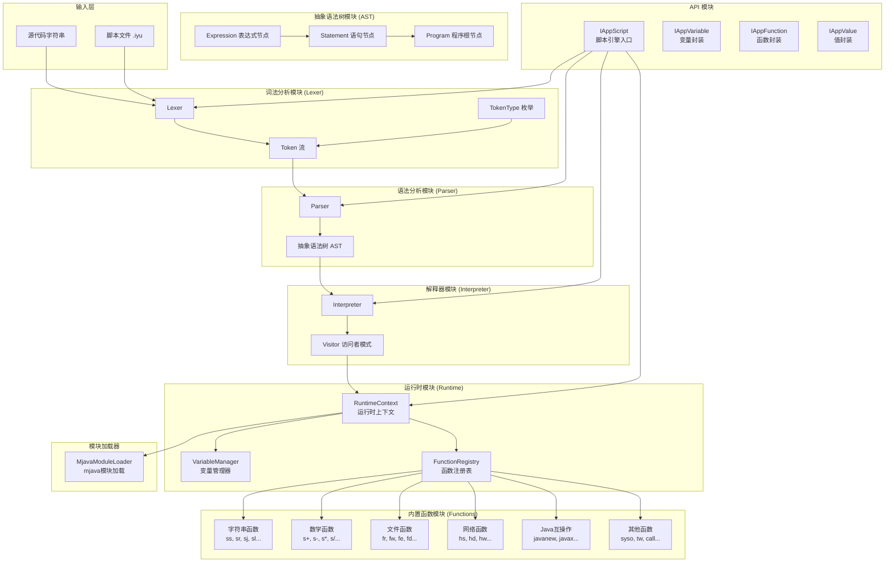

### 核心执行流程图

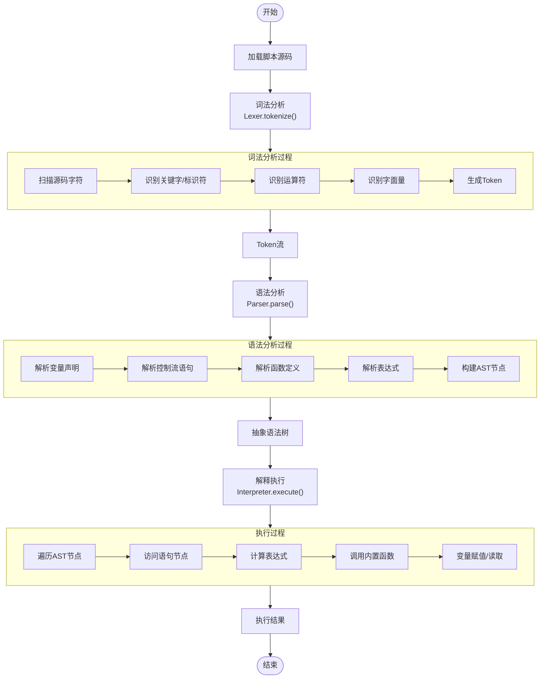

### 词法分析详细流程图

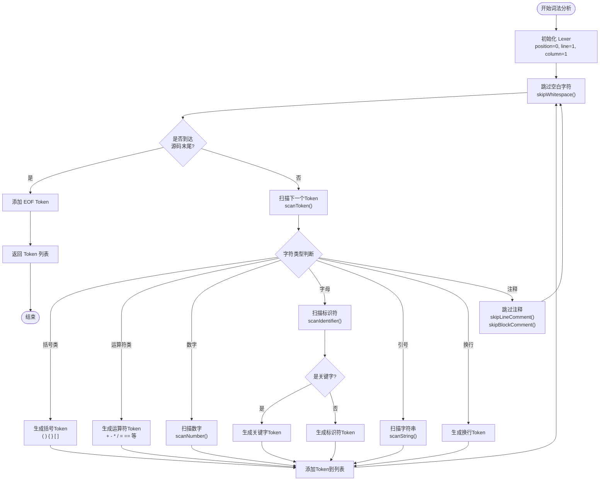

### 语法分析详细流程图

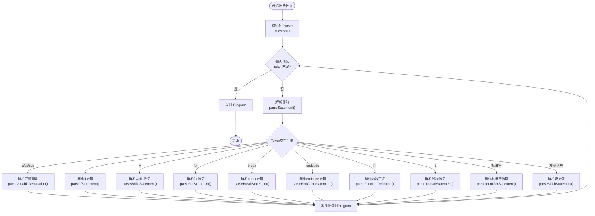

### 表达式解析优先级流程图

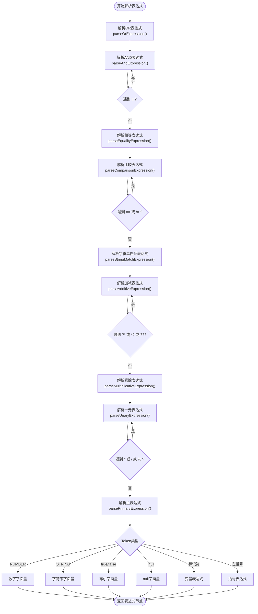

### 解释器执行流程图

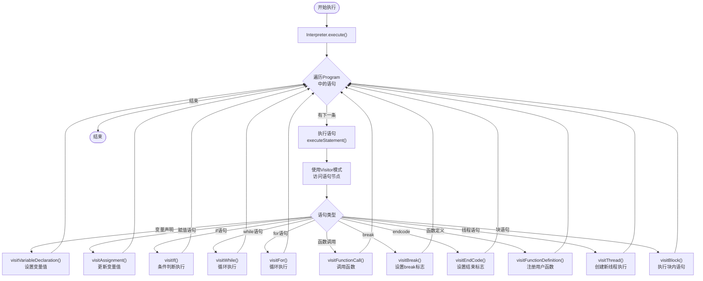

### 函数调用流程图

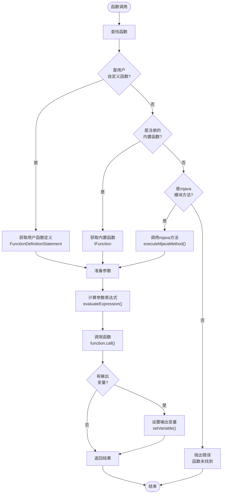

### 变量管理流程图

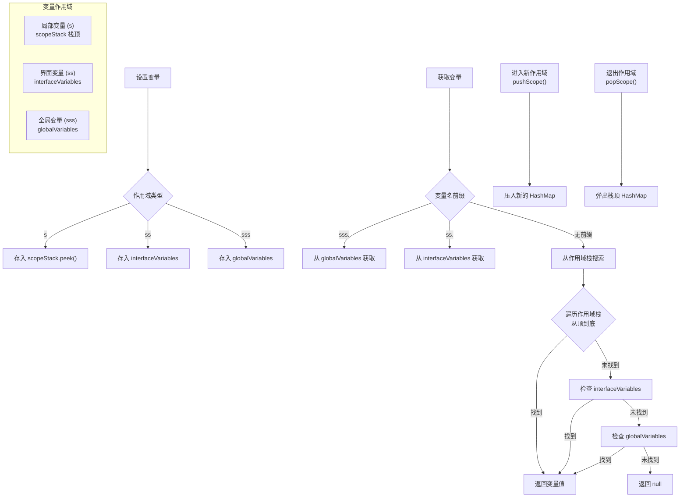

---

## 类图

### 核心类图

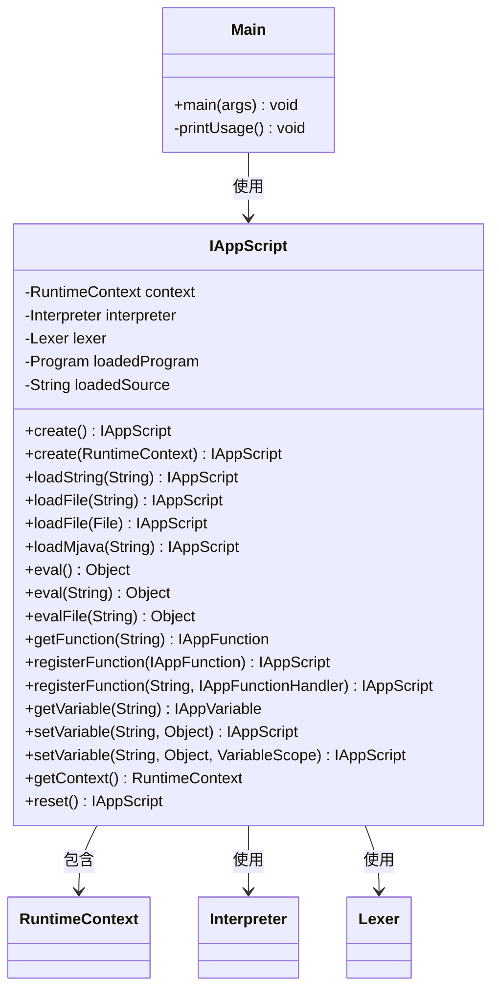

### 词法分析器类图

```mermaid
classDiagram
    class ILexer {
        <<interface>>
        +tokenize(String) List~Token~
    }
    
    class Lexer {
        -String source
        -int position
        -int line
        -int column
        -int length
        -Map~String,TokenType~ KEYWORDS
        +Lexer(String)
        +tokenize(String) List~Token~
        +tokenizeInternal() List~Token~
        -scanToken() Token
        -scanString(int, int) Token
        -scanNumber(int, int) Token
        -scanIdentifier(int, int) Token
        -skipWhitespace() void
        -skipLineComment() void
        -skipBlockComment() void
        -isAtEnd() boolean
        -advance() char
        -peek() char
        -peekNext() char
        -match(char) boolean
        -isDigit(char) boolean
        -isAlpha(char) boolean
        -isAlphaNumeric(char) boolean
    }
    
    class Token {
        -TokenType type
        -String value
        -int line
        -int column
        +Token(TokenType, String, int, int)
        +getType() TokenType
        +getValue() String
        +getLine() int
        +getColumn() int
        +toString() String
    }
    
    class TokenType {
        <<enumeration>>
        KEYWORD_S
        KEYWORD_SS
        KEYWORD_SSS
        KEYWORD_IF
        KEYWORD_ELSE
        KEYWORD_WHILE
        KEYWORD_FOR
        KEYWORD_BREAK
        KEYWORD_ENDCODE
        KEYWORD_FN
        KEYWORD_END
        KEYWORD_TRUE
        KEYWORD_FALSE
        KEYWORD_NULL
        KEYWORD_T
        IDENTIFIER
        NUMBER
        STRING
        PLUS
        MINUS
        STAR
        SLASH
        PERCENT
        PLUS_PLUS
        MINUS_MINUS
        EQUALS
        PLUS_EQUALS
        MINUS_EQUALS
        STAR_EQUALS
        SLASH_EQUALS
        EQ
        NE
        LT
        GT
        LE
        GE
        AND
        OR
        NOT
        STARTS_WITH
        ENDS_WITH
        CONTAINS
        LPAREN
        RPAREN
        LBRACE
        RBRACE
        LBRACKET
        RBRACKET
        COMMA
        DOT
        SEMICOLON
        COLON
        NEWLINE
        EOF
        UNKNOWN
    }
    
    class LexerException {
        -int line
        -int column
        +LexerException(String, int, int)
        +getLine() int
        +getColumn() int
    }
    
    ILexer <|.. Lexer : 实现
    Lexer --> Token : 生成
    Token --> TokenType : 包含
    Lexer ..> LexerException : 抛出
```

### 语法分析器类图

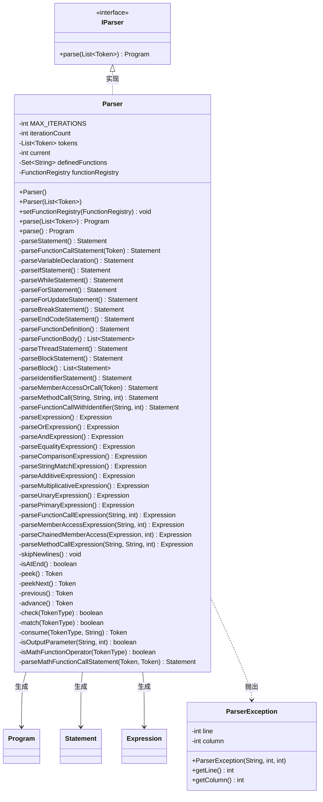

### AST语句节点类图

```mermaid
classDiagram
    class Statement {
        <<abstract>>
        -int line
        #Statement(int)
        +getLine() int
        +accept~T~(StatementVisitor~T~) T
    }
    
    class StatementVisitor {
        <<interface>>
        +visitVariableDeclaration(VariableDeclarationStatement) T
        +visitAssignment(AssignmentStatement) T
        +visitIf(IfStatement) T
        +visitWhile(WhileStatement) T
        +visitFor(ForStatement) T
        +visitFunctionCall(FunctionCallStatement) T
        +visitBreak(BreakStatement) T
        +visitEndCode(EndCodeStatement) T
        +visitFunctionDefinition(FunctionDefinitionStatement) T
        +visitThread(ThreadStatement) T
        +visitBlock(BlockStatement) T
    }
    
    class Program {
        -List~Statement~ statements
        +Program()
        +addStatement(Statement) void
        +getStatements() List~Statement~
    }
    
    class VariableDeclarationStatement {
        -TokenType scope
        -String variableName
        -Expression initialValue
        +VariableDeclarationStatement(int, TokenType, String, Expression)
        +getScope() TokenType
        +getVariableName() String
        +getInitialValue() Expression
    }
    
    class AssignmentStatement {
        -String variableName
        -Expression value
        -TokenType scope
        -Expression index
        +AssignmentStatement(int, String, Expression, TokenType)
        +AssignmentStatement(int, String, Expression, Expression, TokenType)
        +getVariableName() String
        +getValue() Expression
        +getScope() TokenType
        +getIndex() Expression
        +isArrayAssignment() boolean
    }
    
    class IfStatement {
        -Expression condition
        -List~Statement~ thenStatements
        -List~ElseIfClause~ elseIfClauses
        -List~Statement~ elseStatements
        +IfStatement(int, Expression, List~Statement~)
        +getCondition() Expression
        +getThenStatements() List~Statement~
        +getElseIfClauses() List~ElseIfClause~
        +getElseStatements() List~Statement~
        +addElseIfClause(ElseIfClause) void
        +setElseStatements(List~Statement~) void
    }
    
    class ElseIfClause {
        <<record>>
        -Expression condition
        -List~Statement~ statements
    }
    
    class WhileStatement {
        -Expression condition
        -List~Statement~ body
        +WhileStatement(int, Expression, List~Statement~)
        +getCondition() Expression
        +getBody() List~Statement~
    }
    
    class ForStatement {
        -Expression start
        -Expression end
        -Expression step
        -String variableName
        -List~Statement~ body
        -ForType forType
        -Statement initStatement
        -Expression condition
        -Statement updateStatement
        +ForStatement(int, Expression, Expression, Expression, List~Statement~)
        +ForStatement(int, String, Expression, List~Statement~)
        +ForStatement(int, Statement, Expression, Statement, List~Statement~)
        +getStart() Expression
        +getEnd() Expression
        +getStep() Expression
        +getVariableName() String
        +getBody() List~Statement~
        +getForType() ForType
        +getInitStatement() Statement
        +getCondition() Expression
        +getUpdateStatement() Statement
    }
    
    class ForType {
        <<enumeration>>
        RANGE
        ARRAY_ITERATION
        C_STYLE
    }
    
    class FunctionCallStatement {
        -String functionName
        -List~Expression~ arguments
        -List~String~ outputVariables
        -TokenType resultScope
        +FunctionCallStatement(int, String, List~Expression~, List~String~, TokenType)
        +getFunctionName() String
        +getArguments() List~Expression~
        +getOutputVariables() List~String~
        +getResultScope() TokenType
        +hasOutputVariables() boolean
    }
    
    class FunctionDefinitionStatement {
        -String moduleName
        -String functionName
        -List~String~ parameters
        -List~Statement~ body
        +FunctionDefinitionStatement(int, String, String, List~String~, List~Statement~)
        +getModuleName() String
        +getFunctionName() String
        +getParameters() List~String~
        +getBody() List~Statement~
        +getFullName() String
    }
    
    class BreakStatement {
        +BreakStatement(int)
    }
    
    class EndCodeStatement {
        +EndCodeStatement(int)
    }
    
    class ThreadStatement {
        -List~Statement~ body
        +ThreadStatement(int, List~Statement~)
        +getBody() List~Statement~
    }
    
    class BlockStatement {
        -List~Statement~ statements
        +BlockStatement(int, List~Statement~)
        +getStatements() List~Statement~
    }
    
    Statement <|-- VariableDeclarationStatement
    Statement <|-- AssignmentStatement
    Statement <|-- IfStatement
    Statement <|-- WhileStatement
    Statement <|-- ForStatement
    Statement <|-- FunctionCallStatement
    Statement <|-- FunctionDefinitionStatement
    Statement <|-- BreakStatement
    Statement <|-- EndCodeStatement
    Statement <|-- ThreadStatement
    Statement <|-- BlockStatement
    
    Statement --> StatementVisitor : 使用
    IfStatement --> ElseIfClause : 包含
    ForStatement --> ForType : 使用
    Program --> Statement : 包含
```

### AST表达式节点类图

```mermaid
classDiagram
    class Expression {
        <<abstract>>
        -int line
        #Expression(int)
        +getLine() int
        +accept~T~(ExpressionVisitor~T~) T
    }
    
    class ExpressionVisitor {
        <<interface>>
        +visitNumberLiteral(NumberLiteralExpression) T
        +visitStringLiteral(StringLiteralExpression) T
        +visitBooleanLiteral(BooleanLiteralExpression) T
        +visitNullLiteral(NullLiteralExpression) T
        +visitVariable(VariableExpression) T
        +visitBinary(BinaryExpression) T
        +visitUnary(UnaryExpression) T
        +visitFunctionCall(FunctionCallExpression) T
        +visitArrayAccess(ArrayAccessExpression) T
        +visitMemberAccess(MemberAccessExpression) T
    }
    
    class NumberLiteralExpression {
        -Number value
        +NumberLiteralExpression(int, Number)
        +getValue() Number
    }
    
    class StringLiteralExpression {
        -String value
        +StringLiteralExpression(int, String)
        +getValue() String
    }
    
    class BooleanLiteralExpression {
        -boolean value
        +BooleanLiteralExpression(int, boolean)
        +getValue() boolean
    }
    
    class NullLiteralExpression {
        +NullLiteralExpression(int)
    }
    
    class VariableExpression {
        -String name
        -TokenType scope
        +VariableExpression(int, String, TokenType)
        +getName() String
        +getScope() TokenType
    }
    
    class BinaryExpression {
        -Expression left
        -TokenType operator
        -Expression right
        +BinaryExpression(int, Expression, TokenType, Expression)
        +getLeft() Expression
        +getOperator() TokenType
        +getRight() Expression
    }
    
    class UnaryExpression {
        -TokenType operator
        -Expression operand
        -boolean prefix
        +UnaryExpression(int, TokenType, Expression, boolean)
        +getOperator() TokenType
        +getOperand() Expression
        +isPrefix() boolean
    }
    
    class FunctionCallExpression {
        -String functionName
        -List~Expression~ arguments
        +FunctionCallExpression(int, String, List~Expression~)
        +getFunctionName() String
        +getArguments() List~Expression~
    }
    
    class ArrayAccessExpression {
        -Expression array
        -Expression index
        +ArrayAccessExpression(int, Expression, Expression)
        +getArray() Expression
        +getIndex() Expression
    }
    
    class MemberAccessExpression {
        -Expression object
        -String memberName
        +MemberAccessExpression(int, Expression, String)
        +getObject() Expression
        +getMemberName() String
    }
    
    Expression <|-- NumberLiteralExpression
    Expression <|-- StringLiteralExpression
    Expression <|-- BooleanLiteralExpression
    Expression <|-- NullLiteralExpression
    Expression <|-- VariableExpression
    Expression <|-- BinaryExpression
    Expression <|-- UnaryExpression
    Expression <|-- FunctionCallExpression
    Expression <|-- ArrayAccessExpression
    Expression <|-- MemberAccessExpression
    
    Expression --> ExpressionVisitor : 使用
    BinaryExpression --> Expression : 包含
    UnaryExpression --> Expression : 包含
    FunctionCallExpression --> Expression : 包含
    ArrayAccessExpression --> Expression : 包含
    MemberAccessExpression --> Expression : 包含
```

### 解释器类图

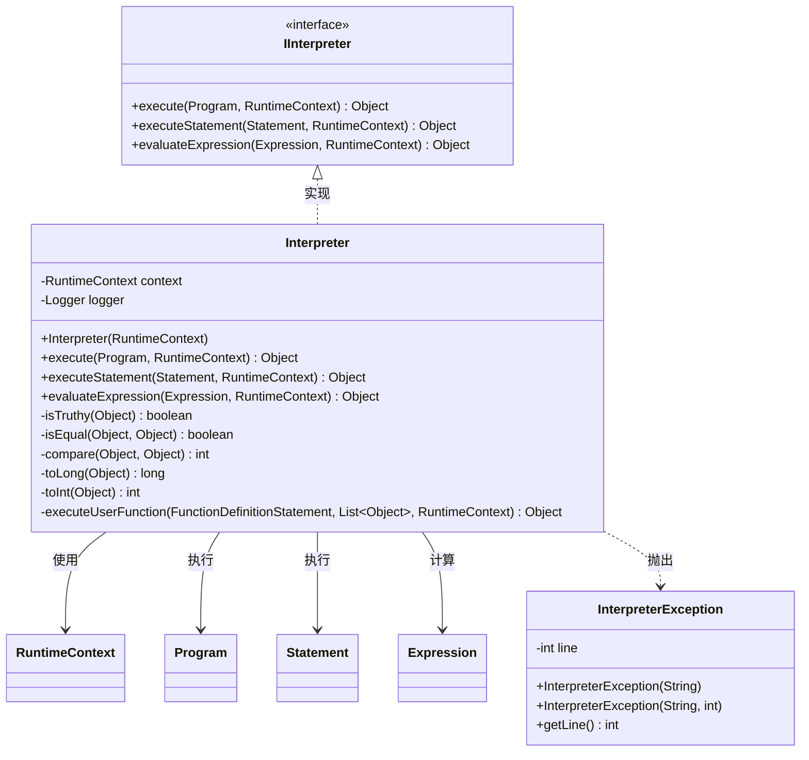

### 运行时类图

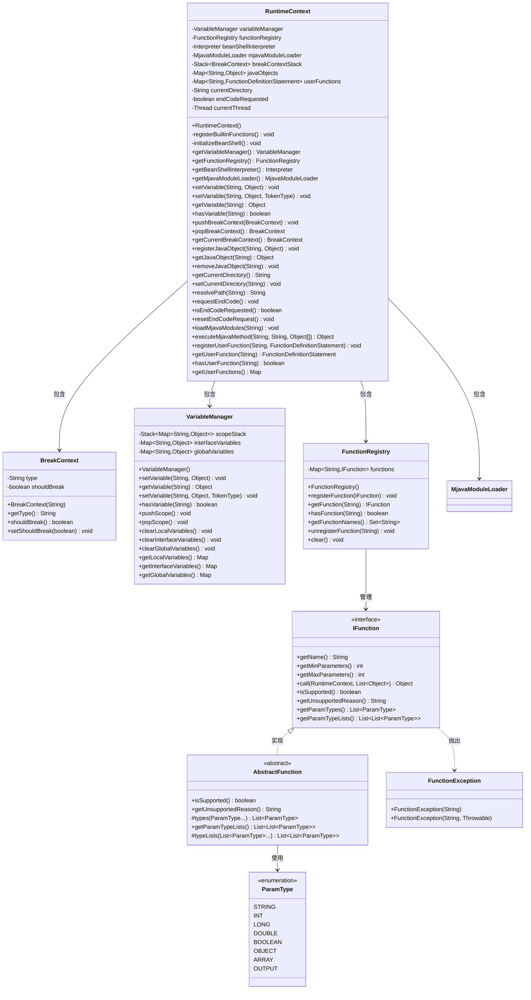

### 内置函数类图

```mermaid
classDiagram
    class AbstractFunction {
        <<abstract>>
        +getName() String
        +getMinParameters() int
        +getMaxParameters() int
        +call(RuntimeContext, List~Object~) Object
        +isSupported() boolean
        +getUnsupportedReason() String
        +getParamTypes() List~ParamType~
        +getParamTypeLists() List~List~ParamType~~
        #types(ParamType...) List~ParamType~
        #typeLists(List~ParamType~...) List~List~ParamType~~
    }
    
    class SysoFunction {
        +getName() String
        +getMinParameters() int
        +getMaxParameters() int
        +call(RuntimeContext, List~Object~) Object
        +getParamTypes() List~ParamType~
    }
    
    class TwFunction {
        +getName() String
        +getMinParameters() int
        +getMaxParameters() int
        +call(RuntimeContext, List~Object~) Object
        +getParamTypes() List~ParamType~
    }
    
    class SsFunction {
        +getName() String
        +getMinParameters() int
        +getMaxParameters() int
        +call(RuntimeContext, List~Object~) Object
        +getParamTypes() List~ParamType~
    }
    
    class SAddFunction {
        +getName() String
        +getMinParameters() int
        +getMaxParameters() int
        +call(RuntimeContext, List~Object~) Object
        +getParamTypes() List~ParamType~
    }
    
    class FrFunction {
        +getName() String
        +getMinParameters() int
        +getMaxParameters() int
        +call(RuntimeContext, List~Object~) Object
        +getParamTypes() List~ParamType~
    }
    
    class HsFunction {
        +getName() String
        +getMinParameters() int
        +getMaxParameters() int
        +call(RuntimeContext, List~Object~) Object
        +getParamTypes() List~ParamType~
        +getParamTypeLists() List~List~ParamType~~
    }
    
    class JavanewFunction {
        +getName() String
        +getMinParameters() int
        +getMaxParameters() int
        +call(RuntimeContext, List~Object~) Object
        +getParamTypes() List~ParamType~
        -parseType(String) Class~?~
        -findConstructor(Class~?~, List~Class~?~~) Constructor~?~
    }
    
    class CallFunction {
        +getName() String
        +getMinParameters() int
        +getMaxParameters() int
        +call(RuntimeContext, List~Object~) Object
        +getParamTypes() List~ParamType~
    }
    
    AbstractFunction <|-- SysoFunction
    AbstractFunction <|-- TwFunction
    AbstractFunction <|-- SsFunction
    AbstractFunction <|-- SAddFunction
    AbstractFunction <|-- FrFunction
    AbstractFunction <|-- HsFunction
    AbstractFunction <|-- JavanewFunction
    AbstractFunction <|-- CallFunction
    
    note for SysoFunction "输出函数\nsyso(obj)"
    note for SsFunction "字符串函数\nss(obj, output)"
    note for SAddFunction "数学函数\ns+(a, b, output)"
    note for FrFunction "文件函数\nfr(path, output)"
    note for HsFunction "网络函数\nhs(url, ...)"
    note for JavanewFunction "Java互操作\njavanew(class, ...)"
    note for CallFunction "模块调用\ncall(output, lang, method, ...)"
```

### API类图

```mermaid
classDiagram
    class IAppScript {
        -RuntimeContext context
        -Interpreter interpreter
        -Lexer lexer
        -Program loadedProgram
        -String loadedSource
        +create() IAppScript
        +create(RuntimeContext) IAppScript
        +loadString(String) IAppScript
        +loadFile(String) IAppScript
        +loadFile(File) IAppScript
        +loadMjava(String) IAppScript
        +loadMjavaFile(String) IAppScript
        +eval() Object
        +eval(String) Object
        +evalFile(String) Object
        +getFunction(String) IAppFunction
        +hasFunction(String) boolean
        +registerFunction(IAppFunction) IAppScript
        +registerFunction(String, IAppFunctionHandler) IAppScript
        +getFunctionNames() Set~String~
        +getVariable(String) IAppVariable
        +setVariable(String, Object) IAppScript
        +setVariable(String, Object, VariableScope) IAppScript
        +hasVariable(String) boolean
        +removeVariable(String) IAppScript
        +getVariableNames() Set~String~
        +getUserFunction(String) IAppFunction
        +hasUserFunction(String) boolean
        +getUserFunctionNames() Set~String~
        +getContext() RuntimeContext
        +setCurrentDirectory(String) IAppScript
        +getCurrentDirectory() String
        +valueOf(Object) IAppValue
        +nil() IAppValue
        +reset() IAppScript
    }
    
    class IAppVariable {
        -String name
        -Object value
        -VariableScope scope
        +IAppVariable(String, Object)
        +IAppVariable(String, Object, VariableScope)
        +getName() String
        +getValue() Object
        +getScope() VariableScope
        +isNil() boolean
        +isString() boolean
        +isNumber() boolean
        +isBoolean() boolean
        +isArray() boolean
        +isList() boolean
        +getType() Class~?~
        +asString() String
        +asString(String) String
        +asInt() int
        +asInt(int) int
        +asLong() long
        +asLong(long) long
        +asDouble() double
        +asDouble(double) double
        +asBoolean() boolean
        +asBoolean(boolean) boolean
        +asArray() Object[]
        +asList() List~?~
        +toValue() IAppValue
    }
    
    class VariableScope {
        <<enumeration>>
        LOCAL s
        INTERFACE ss
        GLOBAL sss
        -String keyword
        +getKeyword() String
        +fromKeyword(String) VariableScope
    }
    
    class IAppValue {
        -Object value
        -ValueType type
        -IAppValue NIL$
        +getType() ValueType
        +toObject() Object
        +isNil() boolean
        +isString() boolean
        +isNumber() boolean
        +isBoolean() boolean
        +isArray() boolean
        +isList() boolean
        +isFunction() boolean
        +asString() String
        +asString(String) String
        +asInt() int
        +asInt(int) int
        +asLong() long
        +asLong(long) long
        +asDouble() double
        +asDouble(double) double
        +asBoolean() boolean
        +asBoolean(boolean) boolean
        +asArray() Object[]
        +asList() List~?~
        +asFunction() IAppFunction
        +valueOf(Object) IAppValue
        +nil() IAppValue
        +valueOf(String) IAppValue
        +valueOf(int) IAppValue
        +valueOf(long) IAppValue
        +valueOf(double) IAppValue
        +valueOf(boolean) IAppValue
        +valueOf(Object[]) IAppValue
        +valueOf(List~?~) IAppValue
    }
    
    class ValueType {
        <<enumeration>>
        NIL
        STRING
        NUMBER
        BOOLEAN
        ARRAY
        LIST
        FUNCTION
        OBJECT
    }
    
    class IAppFunction {
        -String name
        -int minParameters
        -int maxParameters
        -List~ParamType~ paramTypes
        -List~List~ParamType~~ paramTypeLists
        -IAppFunctionHandler handler
        -IFunction wrappedFunction
        -boolean isUserFunction
        -FunctionDefinitionStatement userFunctionDef
        -boolean supported
        -String unsupportedReason
        +getName() String
        +getMinParameters() int
        +getMaxParameters() int
        +getParamTypes() List~ParamType~
        +getParamTypeLists() List~List~ParamType~~
        +getParamTypeInfo() String
        +call(Object...) Object
        +call(IAppScript, Object...) Object
        +isSupported() boolean
        +getUnsupportedReason() String
        +isUserFunction() boolean
        +create(String, IAppFunctionHandler) IAppFunction
        +create(String, int, int, IAppFunctionHandler) IAppFunction
        +wrap(IFunction) IAppFunction
        +fromUserFunction(FunctionDefinitionStatement) IAppFunction
    }
    
    class IAppFunctionHandler {
        <<interface>>
        +call(IAppScript, Object[]) Object
    }
    
    class IAppScriptException {
        +IAppScriptException(String)
        +IAppScriptException(String, Throwable)
        +IAppScriptException(Throwable)
    }
    
    IAppScript --> IAppVariable : 创建
    IAppScript --> IAppFunction : 管理
    IAppScript --> IAppValue : 创建
    IAppScript --> RuntimeContext : 包含
    IAppVariable --> VariableScope : 使用
    IAppVariable --> IAppValue : 转换
    IAppValue --> ValueType : 使用
    IAppFunction --> IAppFunctionHandler : 使用
    IAppFunction ..> IAppScriptException : 抛出
```

### 模块加载器类图

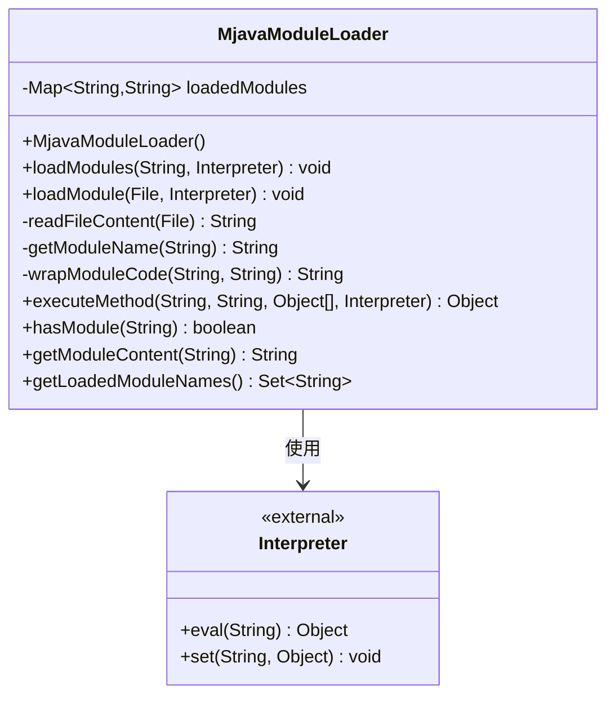

---

## 参与贡献

欢迎提交 Issue 和 Pull Request！

---

## 开源协议

本项目基于 [GPL 3.0](LICENSE) 协议开源。

---

## English

A PC interpreter based on Yulang V3 syntax.

### Features

- Full Yulang V3 syntax support
- Cross-platform (Windows / macOS / Linux)
- Complete lexer, parser, and interpreter
- Custom functions and modular development
- Java interoperability
- Network requests and file operations

### Unsupported Functions

Some Android-specific functions are not supported. See [del.txt](del.txt) for details.

### License

GPL 3.0
